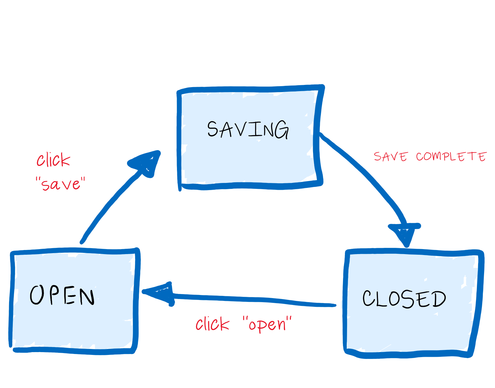

# useReducer-demo

## How to use `useReducer`

`useReducer` is a primitive React hook that allows you to manage state through dispatching "actions". At minimum, `useReducer` takes two arguments: 
* `reducer`, which is a reducer function that returns a new state
* `initState`, which represents the initial state value

### What's a reducer?

A reducer is a *pure function* that operates on two parameters, `state` and `action`. The reducer returns a new state that is based exclusively on `state` (old state) and `action` (the event and its associated data)

> old state + action => new state

### Example

```
const initState = {
  a: ...,
  b: ...,
}

const reducer = (state, action) => {
  switch(action.type) {
    case SOME_ACTION: ...
    case ANOTHER_ACTION: ...
    default: ...
  }
};

const [state, dispatch] = useReducer(reducer, initState);
```

## When to use `useReducer`

Quoting the [React docs](https://reactjs.org/docs/hooks-reference.html#usereducer)

> useReducer is usually preferable to useState when you have complex state logic that involves multiple sub-values or when the next state depends on the previous one. useReducer also lets you optimize performance for components that trigger deep updates because you can pass dispatch down instead of callbacks.

- Multiple, related state values (e.g. form?)
- New state is based on previous state (i.e. state machine)

- Optimizing performance by passing dispatch, which React guarantees will stay the same between renders

**If a portion of your state relies on the value of another portion of state, then it is almost certainly a good use case for `useReducer`**

## Benefits of using `useReducer`

The reducer can be kept separate of the React component and imported as a separate module. Therefore, state and state-transition testing can be done separate of the component, greatly simplifying the implementation of unit tests. 

Secondly, the dev has fine-grained control over the *when* and *how* a state change happens. The dev has the ability to implement how old and new states compare, performance optimizations around the comparisons.


